# **Application-CROUS**

# Contexte
Le C.R.O.U.S (Centre Régional de Oeuvres Universitaires et Scolaires) est un établissement public placé sous la tutelle du Ministère de l'Enseignement supérieur. Il a pour mission d'améliorer les conditions de vie et de travail des étudiants de l'académie de Créteil.

L'une des missions principales est le logement des étudiants. Il propose aux éleves habitant en colocation une application mieux organiser leur dépenses et donc leur budget.

# Outils mis en oeuvre
Pour réaliser ce projet on a mis en oeuvre plusiers outils :
1. Visual Studio 2017 (Windows Form, C#, ado.net)
2. Visual Studio Code (PlantUML)
3. Git 
4. MySQL (MySQL Lite pour la base de données)

# Composants logiciels à développer

## 1. Gérer les colocataires
### Objectif
→ L'objectif est de tenir en compte toutes les colocataires qui utilisent l'application ainsi que modifier ou supprimer un colocataire si besoin.
### Cas Utilisation
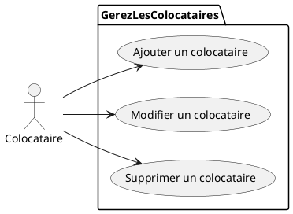
### Maquette
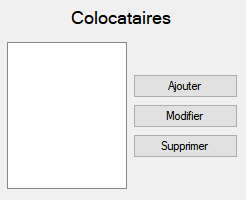
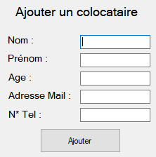
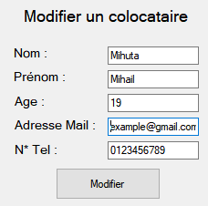
### Enchaînement Textuel
→ Ajouter un colocataire : on clique sur le bouton "Ajouter". Après, on compléte les champs nécessaires (nom, prénom, age, adresse mail, n° tel). Après avoir fini on clique sur le bouton "Ajouter" pour ajouter le colocataire.  
→ Modifier un colocataire : on clique le colocataire qu'on veut modifier dans la liste et on clique sur le bouton "Modifier". On modifier n'importe quels données on choisi et une fois fini, on clique sur le bouton "Modifier".  
→ Supprimer un colocataire : on clique le colocataire qu'on veut supprimer dans la liste et on clique sur le bouton "Supprimer". 

## 2. Enregistrer les dépenses
### Objectif
→ L'objectif est d'enregistrer toutes les dépenses faite par chaque colocataire ainsi que les modifier en cas de besoin. Ces données vont être aussi utiliser pour la mise en répartition.
### Cas Utilisation
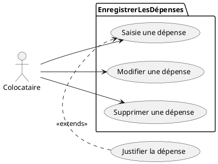
### Maquette
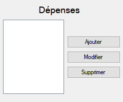
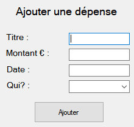
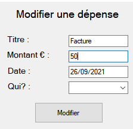
### Enchaînement Textuel
→ Ajouter une dépense : on clique sur le bouton "Ajouter". Après, on compléte les champs nécessaires (titre, montant, date, qui?) (Le champ "Qui?" est une liste déroulante avec toutes les colocataires enregistré). Finalement, on clique sur le bouton "Ajouter" pour ajouter la dépense.  
→ Modifier une dépense : on clique la dépense qu'on veut modifier dans la liste et on clique sur le bouton "Modifier". On modifier n'importe quels données on choisi et une fois fini, on clique sur le bouton "Modifier".  
→ Supprimer une dépense : on clique la dépense qu'on veut supprimer dans la liste et on clique sur le bouton "Supprimer". 

## 3. Mise en répartition
### Objectif
→ L'objectif de la mise en répartition est de calculer le montant que chaque personne a payé, aurait du payer et les soldes à régler sur une certaine période (c'est les colocataires qui choisissent quand ils veulent lancer la répartition). Une fois calculé, ces données vont être afficher dans un tableau pour que la personne soit capable de le visualer.
### Cas Utilisation
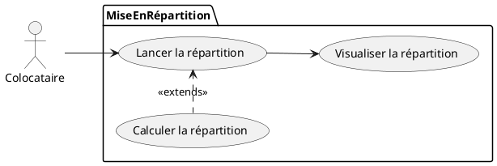
### Maquette
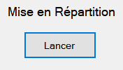
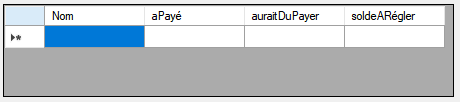
### Enchaînement Textuel
→ On clique sur le bouton "Lancer" pour lancer la mise en répartition. Ensuite on va avoir un tableau qui va nous présenter le montant payé par chaque personne, le montant qu'on aurait dû payer et les soldes à régler.

## 4. Solder une période
### Objectif
→ L'objectif de solder une période est de répartir les dépenses pour qu'ils ne sont pris plus en compte lors de la prochaine répartition.
### Cas Utilisation
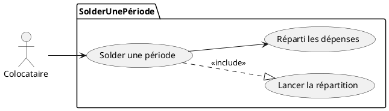
### Maquette

### Enchaînement Textuel
→ 

# Base de données
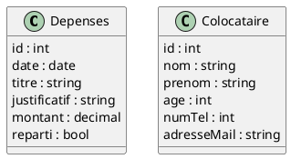

# Diagramme de Classe
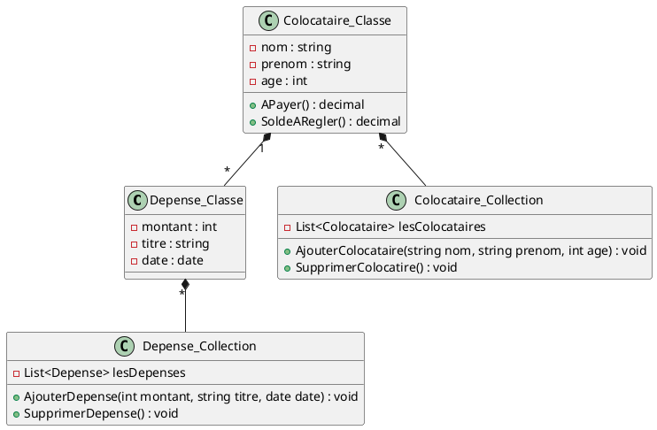

