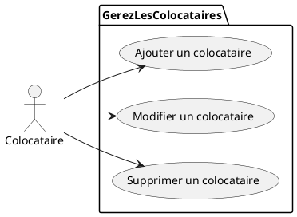
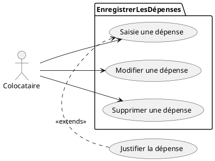
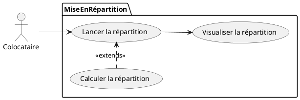

# **Application-CROUS**
# Composants logiciels à développer

## 1. Gérer les colocataires
### Objectif
ezdqsdqsdsqdqsdqsdqsdqsqsdsqdsqd
### Cas Utilisation

### Maquette

### Enchaînement Textuel

## 2. Enregistrer les dépenses
### Objectif
ezdqsdqsdsqdqsdqsdqsdqsqsdsqdsqd
### Cas Utilisation

### Maquette

### Enchaînement Textuel

## 3. Mise en répartition
### Objectif
ezdqsdqsdsqdqsdqsdqsdqsqsdsqdsqd
### Cas Utilisation

### Maquette

### Enchaînement Textuel

