# **Application-CROUS**

# Contexte
Le C.R.O.U.S (Centre Régional de Oeuvres Universitaires et Scolaires) est un établissement public placé sous la tutelle du Ministère de l'Enseignement supérieur. Il a pour mission d'améliorer les conditions de vie et de travail des étudiants de l'académie de Créteil.

L'une des missions principales est le logement des étudiants. Il propose aux éleves habitant en colocation une application mieux organiser leur dépenses et donc leur budget.

# Outils mis en oeuvre
Pour réaliser ce projet on a mis en oeuvre plusiers outils :
1. Visual Studio 2017 (Windows Form, C#, ado.net)
2. Visual Studio Code (PlantUML)
3. Git 
4. MySQL (MySQL Lite pour la base de données)

# Composants logiciels à développer

## 1. Gérer les colocataires
### Objectif 
• L'objectif est de tenir en compte toutes les colocataires qui utilisent l'application ainsi que modifier ou supprimer un colocataire si besoin.
### Cas Utilisation - Gérer les colocataires
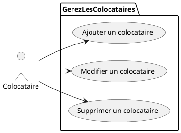
### Maquette - Gérer les colocataires
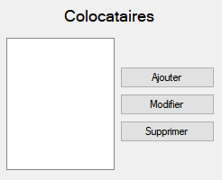
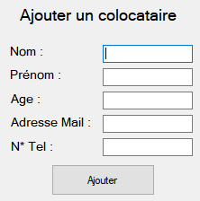
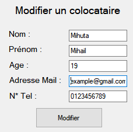
### Enchaînement Textuel - Gérer les colocataires
• <i> **Ajouter un colocataire** </i> <br>
    1. On clique sur le bouton **Ajouter** pour ajouter un nouveau colocataire. <br>
    2. On complète les champs (nom, prénom, age, adresse mail, n° tel). <br>
    3. On cliquer sur le bouton **Ajouter** après pour finir <br>
<br>
• <i> **Modifier un colocataire** </i> <br>
    1. On clique sur le colocataire qu'on veut modifier. <br>
    2. On clique sur le bouton **Modifier** pour modifier les données d'un colocataire<br> 
    3. On modifie les données qu'on a besoin de modifier. <br>
    4. On clique sur le bouton **Modifier** après avoir fini. <br>
<br>
• <i> **Supprimer un colocataire** </i> <br>
    1. On clique sur le colocataire qu'on veut supprimer. <br>
    2. On clique sur le bouton **Supprimer**.

## 2. Enregistrer les dépenses
### Objectif
→ L'objectif est d'enregistrer toutes les dépenses faite par chaque colocataire ainsi que les modifier en cas de besoin.

### Cas Utilisation - Enregistrer les dépenses
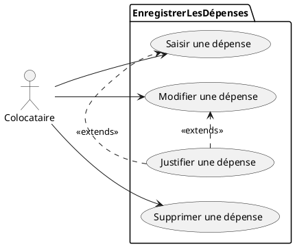
### Maquette - Enregistrer les dépenses
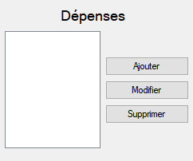
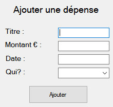
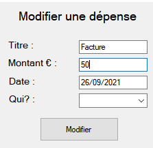
### Enchaînement Textuel - Enregistrer les dépenses
• <i> **Ajouter une dépense** </i> <br>
    1. On clique sur le bouton **Ajouter** pour ajouter une nouvelle dépense. <br>
    2. On complète les champs (titre, montant, date, qui?) (le "qui?" est une liste déroulante où on va choisir le colocataire qui a effectué cette dépense). <br>
    2B. (Optionnel) On peut justifier la dépense en sélectionnant un fichier (jpg,png,pdf,etc).  <br>
    3. On clique sur le bouton **Ajouter** après avoir fini. <br>

• <i> **Modifier une dépense** </i> <br>
    1. On clique sur la dépense qu'on veut modifier. <br>
    2. On clique sur le bouton **Modifier**.<br>
    3. On modifie les données qu'on a besoin de modifier. <br>
    4. On clique sur le bouton **Modifier** après avoir fini. <br>

• <i> **Supprimer une dépense** </i> <br>
    1. On clique sur la dépense qu'on veut supprimer <br>
    2. On clique sur le bouton **Supprimer** <br>

## 3. Mise en répartition
### Objectif
→ L'objectif de la mise en répartition est de calculer le montant que chaque personne a payé, aurait du payer et les soldes à régler sur une certaine période (c'est les colocataires qui choisissent quand ils veulent lancer la répartition). Une fois calculé, ces données vont être afficher dans un tableau pour que la personne soit capable de le visualer.
### Cas Utilisation - Mise en répartition
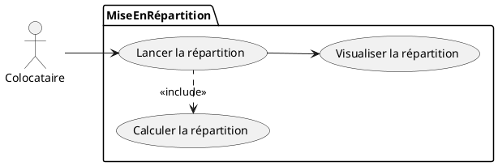
### Maquette - Mise en répartition
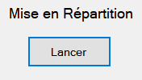
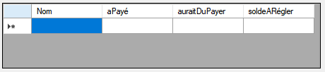
### Enchaînement Textuel - Mise en répartition
• <i> **Lancer la répartition** </i> <br>
    1. On clique sur le bouton **Lancer**. <br>
    2. Ceci va lancer la mise en répartition qui va calculer le montant payé par chaque colocataire, le montant qu'ils aurait dû payer et les soldes à régler. .<br>
    3. On visualise le tableau avec toutes les données précédentes. <br>

## 4. Solder une période
### Objectif
→ L'objectif de solder une période est de répartir les dépenses pour qu'ils ne sont pris plus en compte lors de la prochaine répartition.
### Cas Utilisation - Solder une période
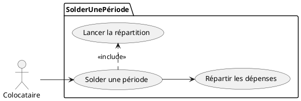
### Maquette - Solder une période


### Enchaînement Textuel - Solder une période
• <i> **Solder une période** </i> <br>
    1. On clique sur le bouton **Solder une période**. <br>
    2. Toutes les dépenses précédentes vont être réparti<br>
    3. Ceci lance la mise en répartition. <br>

# Base de données
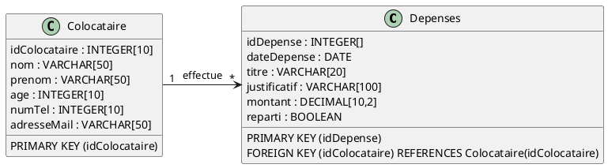

### Voici le script SQL
```
 CREATE TABLE Colocataire (
    idColocataire INTEGER(10) NOT NULL AUTO_INCREMENT,
    nom VARCHAR(50),
    prenom VARCHAR(50),
    age INTEGER(10),
    numTel INTEGER(10),
    adresseMail VARCHAR(50),
    PRIMARY KEY (idColocataire)
) ENGINE = InnoDB;

CREATE TABLE Depenses (
    idDepenses INTEGER(10) NOT NULL AUTO_INCREMENT,
    dateDepense DATE,
    titre VARCHAR(20),
    justificatif VARCHAR(100),
    montant DECIMAL(10,2),
    reparti BOOLEAN,
    PRIMARY KEY (idDepenses),
    FOREIGN KEY (idColocataire) REFERENCES Colocataire(idColocataire)
) ENGINE = InnoDB;
```


# Diagramme de Classe
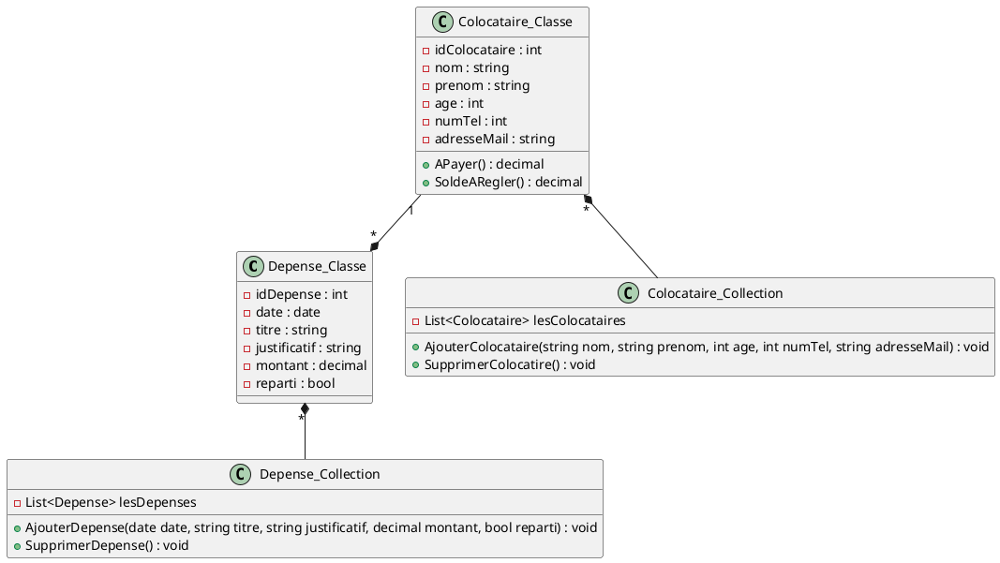


