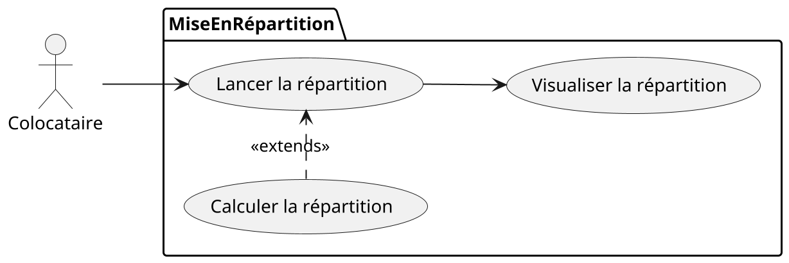

# Application-CROUS

```plantuml
@startuml model1
scale 2
left to right direction
actor Colocataire as c

package MiseEnRépartition{
    usecase "Lancer la répartition" as UC1
    usecase "Visualiser la répartition" as UC2
    usecase "Calculer la répartition" as UC3
}
c --> UC1
UC1 --> UC2
UC3 .> UC1 : <<extends>>
@enduml
```

