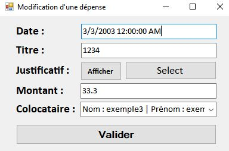
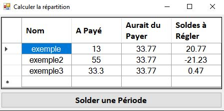

# **Application-CROUS**

# (Problèmes)
Lors du clônage si l'application ne marche pas, il existe quelques solutions a mettre en place <br>
**•** Il faut définir **VIEW** comme projet de démarrage <br>
→ Clique-droit sur le projet **VIEW** et on clique sur **Set as Startup Project**<br>
**•** Dans le dossier **DAO** → **Bin** → **Debug** il faut mettre **MySql.Data.dll** <br>
→ Lors du clônage ce fichier n'est pas présent<br>
**•** Générer les **dll** pour **DAO** et **MODEL** <br>
→ Lors du clônage, ces dll ne fonctionne plus (même s'il sont présent). Il faut générer les dll et aller dans les **References** des classes **DAO** et **VIEW** pour bien vérifier qu'il fonctionne.<br>
**•** Installer le nugget **Renci.SshNet.Async**<br>
→ Des fois on peut avoir une problème comme si un nugget **Renci** n'existe pas. Pour résoudre ce problème il faut <br>
Clique-droit sur **VIEW** → **Manage NuGet Packages** → Chercher **Renci.SshNet.Async** → Installer

# Contexte
Le C.R.O.U.S (Centre Régional de Oeuvres Universitaires et Scolaires) est un établissement public placé sous la tutelle du Ministère de l'Enseignement supérieur. Il a pour mission d'améliorer les conditions de vie et de travail des étudiants de l'académie de Créteil.

L'une des missions principales est le logement des étudiants. Il propose aux éleves habitant en colocation une application mieux organiser leur dépenses et donc leur budget.

# Outils mis en oeuvre
Pour réaliser ce projet on a mis en oeuvre plusiers outils :
1. Visual Studio 2017 (Windows Form, C#, ado.net)
2. Visual Studio Code (PlantUML)
3. Git 
4. MySQL (pour la base de données)

# Composants logiciels à développer

## 1. Gérer les colocataires
### Objectif 
**•** L'objectif est de tenir en compte toutes les colocataires qui utilisent l'application ainsi que modifier ou supprimer un colocataire si besoin.
### Cas Utilisation - Gérer les colocataires

### Maquette - Gérer les colocataires


### Enchaînement Textuel - Gérer les colocataires
**•** <i> **Consulter la liste des colocataires** </i> <br>
    1. On clique sur le bouton **Gestion des Colocataires** pour consulter les colocataires existant. <br>
<br>
**•** <i> **Ajouter un colocataire** </i> <br>
    1. On clique sur le bouton **Gestion des Colocataires** pour accéder au gestion des colocataires. <br>
    2. On clique sur le bouton **AJOUTER** pour ajouter un nouveau colocataire. <br>
    3. On complète les champs (nom, prénom, age, adresse mail, n° tel). Le champ **Id** est **ReadOnly** (il ne peut pas être modifier) <br>
    4. On cliquer sur le bouton **Valider** pour ajouter le nouveau colocataire dans la liste <br>
<br>
**•** <i> **Modifier un colocataire** </i> <br>
    1. On clique sur le colocataire qu'on veut modifier. <br>
    2. On clique sur le bouton **MODIFIER**.<br> 
    3. On modifie les données qu'on a besoin de modifier (sauf **Id**) <br>
    4. On clique sur le bouton **Valider** pour valider les modifications. <br>
<br>
**•** <i> **Supprimer un colocataire** </i> <br>
    1. On clique sur le colocataire qu'on veut supprimer. <br>
    2. On clique sur le bouton **SUPPRIMER**.<br>
<br>
**•** <i> **Sauvegarder les modifications effectué** </i> <br>
    1. On clique sur le bouton **SAUVEGARDER** pour enregistrer toutes les modifications dans la base de données. <br>

## 2. Enregistrer les dépenses
### Objectif
→ L'objectif est d'enregistrer toutes les dépenses faite par chaque colocataire ainsi que les modifier en cas de besoin.

### Cas Utilisation - Enregistrer les dépenses

### Maquette - Enregistrer les dépenses



### Enchaînement Textuel - Enregistrer les dépenses
**•** <i> **Consulter la liste des dépenses** </i> <br>
    1. On clique sur le bouton **Gestion des Dépenses** pour consulter les dépenses existantes. <br>
<br>
**•** <i> **Ajouter une dépense** </i> <br>
    1. On clique sur le bouton **Gestion des Dépenses** pour accéder au gestion des dépenses. <br>
    2. On clique sur le bouton **AJOUTER** pour ajouter une nouvelle dépense. <br>
    3. On complète les champs (date,titre,justificatif,montant,colocataire) ("justificatif" nous permet de choisir un fichier image (jpg,png,etc)). <br>
    4. On clique sur le bouton **Valider** pour ajouter la nouvelle dépense dans la liste. <br>

**•** <i> **Modifier une dépense** </i> <br>
    1. On clique sur la dépense qu'on veut modifier. <br>
    2. On clique sur le bouton **MODIFIER**.<br>
    3. On modifie les données qu'on a besoin de modifier. <br>
    4. On clique sur le bouton **Valider** pour valider les modifications. <br>

**•** <i> **Supprimer une dépense** </i> <br>
    1. On clique sur la dépense qu'on veut supprimer <br>
    2. On clique sur le bouton **SUPPRIMER** <br>

**•** <i> **Sauvegarder les modifications effectué** </i> <br>
    1. On clique sur le bouton **SAUVEGARDER** pour enregistrer toutes les modifications dans la base de données. <br>

## 3. Mise en répartition
### Objectif
→ L'objectif de la mise en répartition est de calculer le montant que chaque personne a payé, aurait du payer et les soldes à régler sur une certaine période (c'est les colocataires qui choisissent quand ils veulent lancer la répartition). Une fois calculé, ces données vont être afficher dans un tableau pour que la personne soit capable de le visualer.
### Cas Utilisation - Mise en répartition

### Maquette - Mise en répartition


### Enchaînement Textuel - Mise en répartition
**•** <i> **Mise en répartition** </i> <br>
    1. On clique sur le bouton **Mise en répartition** pour lancer la mise en répartition. <br>
    2. Ceci va calculer le montant payé par chaque colocataire, le montant qu'ils aurait dû payer et les soldes à régler.<br>

## 4. Solder une période
### Objectif
→ L'objectif de solder une période est de répartir les dépenses pour qu'ils ne sont pris plus en compte lors de la prochaine répartition.
### Cas Utilisation - Solder une période

### Maquette - Solder une période


### Enchaînement Textuel - Solder une période
**•** <i> **Solder une période** </i> <br>
    1. Une fois que la mise en répartition est fini, on clique sur le bouton **Solder une Période**. <br>
    2. Une fenêtre va apparaître en disant si on est sûr de solder cette période. Dans le cas où on a cliqué sur le bouton **Solder une Période** sans faire exprès, on peut répondre **non** et le soldage de la période va être annuler. Si on veut continuer on clique sur **oui**.<br>
    3. Un message disant que la période a été soldé va apparaître. <br>
    4. La mise en répartition va être lancer et si tout s'est bien passé, toutes les valeurs dans le tableau vont être 0€ puisqu'on prend plus en compte ces dépenses. <br>

# Base de données


### Voici le script SQL
```
USE mysql;
drop database if exists crous;
CREATE DATABASE crous;
USE crous;

 CREATE TABLE Colocataire (
    id INTEGER(10) NOT NULL AUTO_INCREMENT,
    nom VARCHAR(50),
    prenom VARCHAR(50),
    age INTEGER(10),
    numTel INTEGER(10),
    adresseMail VARCHAR(50),
    PRIMARY KEY (id)
) ENGINE = InnoDB;

CREATE TABLE Depenses (
    id INTEGER(10) NOT NULL AUTO_INCREMENT,
    dateDepense DATE,
    titre VARCHAR(20),
    justificatif VARCHAR(200),
    montant FLOAT,
    reparti TINYINT,
    idColocataire INTEGER(10) NOT NULL,
    PRIMARY KEY (id)
) ENGINE = InnoDB;

ALTER TABLE Depenses ADD CONSTRAINT fk_Colocataire_A_Depenses FOREIGN KEY (idColocataire) REFERENCES Colocataire(id);

```


# Diagramme de Classe


# Description des méthodes
### Colocataire
**•** **int Id() : int **.....** State state() : State** <br>
→ Accésseurs & Mutateurs des données membres privées<br>
**•** **Colocataire(int id, string nom, string prenom, int age, int numTel, string adresseMail, State state)** <br> 
→ Constructeur <br>
**•** **void Remove() : void** <br>
→ Cette fonction change le State d'un élément a **State.deleted**. On peut l'utiliser pour supprimer un élement (colocataire/dépense) <br>
**•** **string ToString() : string** <br>
→ Cette méthode est utiliser pour afficher les données membres d'un colocataire sous forme d'une chaîne de caractères.
### Colocataires
**•** **int Count() : int**<br>
→ Cette méthode permet de compter le nombre des colocataires dans la collection **lesColocataires**<br>
**•** **Colocataire this[int index] : Colocataire**<br>
→ Cette méthode permet d'avoir l'index d'un élément qu'on spécifie dans la collection<br>
**•** **void AjouterColocataire(Colocataire nouveauColocataire) : void**<br>
→ Cette méthode permet d'ajouter un nouveau colocataire dans la collection **lesColocataires**<br>
**•** **void SupprimerColocataire(Colocataire colocataire) : void**<br>
→ Cette méthode permet de supprimer un colocataire de la collection **lesColocataires**<br>
**•** **int GetIndex(string nom) : int**<br>
→ Cette méthode permet d'avoir le index d'après son nom dans la collection **lesColocataires**
**•** **int GetIndex(int index) : int**<br>
→ Cette méthode permet d'avoir le index d'après l'index de la collection (ex : l'index dans la collection est 0 mais son id dans la base de données est 8, si on met 8, la méthode ne marche pas à cause d'un dépassement d'index)**lesColocataires**
**•** **string GetNom(int index) : string**<br>
→ Cette méthode permet d'avoir le index d'après son nom dans la collection **lesColocataires**
### Depense
**•** **int Id() : int **.....** State state() : State** <br>
→ Accésseurs & Mutateurs des données membres privées<br>
**•** **Depense(int id, DateTime date, string titre, string justificatif, double montant, bool reparti, int IdColocataire, State state)** <br> 
→ Constructeur <br>
**•** **Depense(int id, DateTime date, string titre, string justificatif, double montant, int IdColocataire, State state)** <br> 
→ Constructeur <br>
**•** **void Remove() : void** <br>
→ Cette fonction change le State d'un élément a **State.deleted**. On peut l'utiliser pour supprimer un élement (colocataire/dépense) <br>
**•** **string ToString() : string** <br>
→ Cette méthode est utiliser pour afficher les données membres d'une dépense sous forme d'une chaîne de caractères.
### Depenses
**•** **int Count() : int**<br>
→ Cette méthode permet de compter le nombre des dépenses dans la collection **lesDepenses**<br>
**•** **Depense this[int index] : Depense**<br>
→ Cette méthode permet d'avoir l'index d'un élément qu'on spécifie dans la collection<br>
**•** **void AjouterDepense(Depense nouvelleDepense) : void**<br>
→ Cette méthode permet d'ajouter une nouvelle dépense dans la collection **lesDepenses**<br>
**•** **void SupprimerDepense(Depense depense) : void**<br>
→ Cette méthode permet de supprimer une dépense de la collection **lesDepenses**<br>
**•** **double APayer(int idColocataire) : double**<br>
→ Cette méthode permet de trouver le montant total qu'un colocataire a payé dans les dépenses qui sont pas réparti<br>
**•** **double AuraitDuPayer() : double** <br>
→ Cette méthode calcule le montant total des dépenses et le divise par le nombre de colocataires pour trouver combien chaque colocataire devra payer

