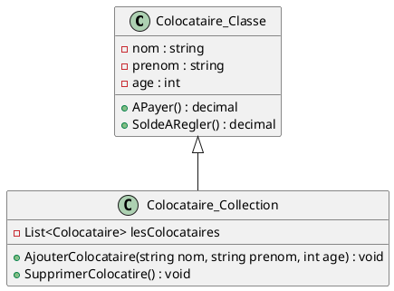
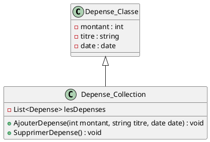

# **Application-CROUS**

# Composants logiciels à développer

## 1. Gérer les colocataires
### Objectif
→ L'objectif est de tenir en compte toutes les colocataires qui utilisent l'application ainsi que modifier ou supprimer un colocataire si besoin.
### Cas Utilisation

### Maquette

### Enchaînement Textuel
→ Ajouter un colocataire : on clique sur le bouton "Ajouter". Après, on compléte les champs nécessaires (nom, prénom, age, adresse mail, n° tel). Après avoir fini on clique sur le bouton "Ajouter" pour ajouter le colocataire.  
→ Modifier un colocataire : on clique le colocataire qu'on veut modifier dans la liste et on clique sur le bouton "Modifier". On modifier n'importe quels données on choisi et une fois fini, on clique sur le bouton "Modifier".  
→ Supprimer un colocataire : on clique le colocataire qu'on veut supprimer dans la liste et on clique sur le bouton "Supprimer". 

## 2. Enregistrer les dépenses
### Objectif
→ L'objectif est d'enregistrer toutes les dépenses faite par chaque colocataire ainsi que les modifier en cas de besoin. Ces données vont être aussi utiliser pour la mise en répartition.
### Cas Utilisation

### Maquette

### Enchaînement Textuel
→ Ajouter une dépense : on clique sur le bouton "Ajouter". Après, on compléte les champs nécessaires (titre, montant, date, qui?) (Le champ "Qui?" est une liste déroulante avec toutes les colocataires enregistré). Finalement, on clique sur le bouton "Ajouter" pour ajouter la dépense.  
→ Modifier une dépense : on clique la dépense qu'on veut modifier dans la liste et on clique sur le bouton "Modifier". On modifier n'importe quels données on choisi et une fois fini, on clique sur le bouton "Modifier".  
→ Supprimer une dépense : on clique la dépense qu'on veut supprimer dans la liste et on clique sur le bouton "Supprimer". 

## 3. Mise en répartition
### Objectif
→ L'objectif est calculer le montant a payer et donc les soldes à régler sur une certaine période. De plus, on doit avoir le montant total payé par chaque colocataire.
### Cas Utilisation

### Maquette

### Enchaînement Textuel
→ On clique sur le bouton "Lancer" pour lancer la mise en répartition. Ensuite on va avoir un tableau qui va nous présenter le montant payé par chaque personne, le montant qu'on aurait dû payer et les soldes à régler.

# Base de données

# Diagramme de Classe
## 1. Colocataire

## 2. Depense

